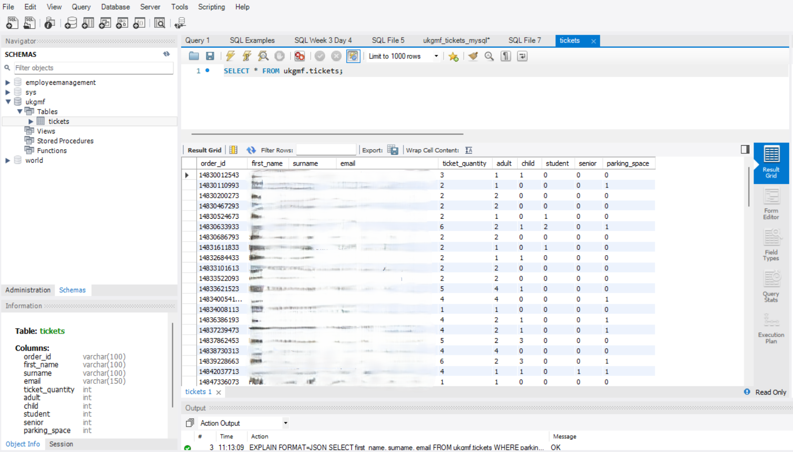
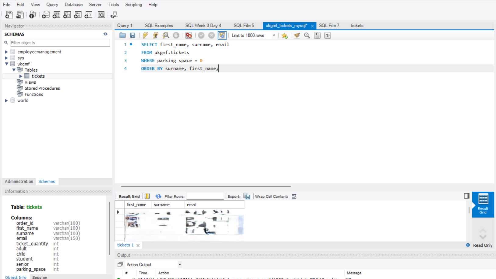
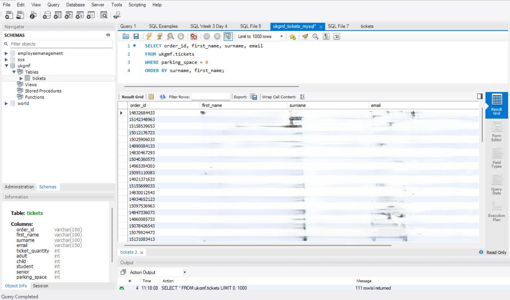
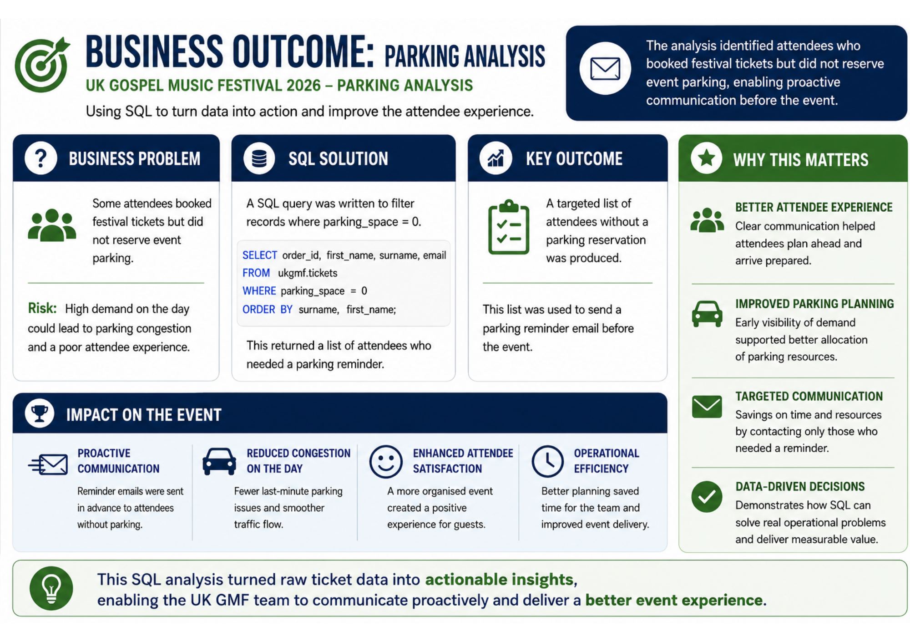

# SQL Event Parking Booking Analysis

## Project Overview

This project showcases how SQL was used to solve a real business problem for the UK Gospel Music Festival.

By comparing event ticket bookings with parking reservations, I identified attendees who had not reserved parking. The results were used to support targeted customer communication before the event, helping improve attendee experience and operational planning.

This project demonstrates the practical application of SQL to solve a real business challenge rather than a classroom exercise.

---

## Business Problem

The UK Gospel Music Festival required a way to identify attendees who had booked festival tickets but had not reserved parking. 
This information was used to send targeted reminder emails before the event, helping attendees plan their journey and improving parking management on the day.

---

## Tools Used

- SQL
- Relational Database
- MySQL

---

## Skills Demonstrated

- SELECT
- WHERE
- ORDER BY
- LEFT JOIN
- INNER JOIN
- Filtering records
- Identifying missing data
- Business problem solving
- Data analysis
- Customer communication support

---

# Project Structure

```

SQL-Event-Parking-Analysis
│
├── README.md
├── SQL Queries
├── Images
│   ├── Database Structure
│   ├── SQL Query
│   ├── Query Results
│   └── Business Outcome:Parking Analysis


```

# Project Gallery

## 1. Databse Structure

The tickets table stores attendee details, ticket quantities and parking reservation information used to support event planning and operational decision-making.

*Personal information has been removed or obscured in accordance with UK GDPR to protect attendee privacy.*



---

## 2. SQL Query

This SQL query identifies attendees who booked festival tickets but did not reserve event parking, allowing the event team to take proactive action before the festival.

*Personal information has been removed or obscured in accordance with UK GDPR to protect attendee privacy.*



---

## 3. Query Results

The query results highlight attendees without a parking reservation, enabling targeted reminder emails to be sent and reducing the risk of congestion or confusion on the event day.

*Personal information has been removed or obscured in accordance with UK GDPR to protect attendee privacy.*



---

## 4. Business Outcome: Parking Analysis

This project demonstrates how SQL can be used to solve a real operational challenge by identifying attendees who required follow-up communication. The analysis supported more effective event planning and helped improve the attendee experience.

*Personal information has been removed or obscured in accordance with UK GDPR to protect attendee privacy.*



---

# Key Insights

- Identified attendees without parking bookings.
- Reduced manual checking of booking records.
- Enabled targeted reminder emails before the event.
- Improved event planning and customer communication.
- Demonstrated how SQL can solve real operational business problems.

---

# Business Impact

This project demonstrates how SQL can be used to solve a real operational challenge.

Ahead of the UK Gospel Music Festival, the event team needed to identify attendees who had purchased event tickets but had not booked parking. With hundreds of bookings to review, manually checking records would have been inefficient and increased the risk of missing customers.

Using SQL, I compared ticket bookings with parking reservations to identify attendees who required follow-up communication.

The query results enabled the event team to:

- Identify attendees without parking reservations.
- Send targeted reminder emails before the event.
- Improve parking planning and capacity management.
- Reduce confusion and delays on event day.
- Make decisions using accurate, data-driven information.

This project demonstrates how SQL can support operational planning, customer communication and business decision-making in a real-world environment.

---

## Future Improvements

Possible enhancements include:

- Automating reminder emails.
- Creating SQL views for reporting.
- Building a Power BI dashboard from the booking database.
- Adding booking trends and attendance analysis.

---
